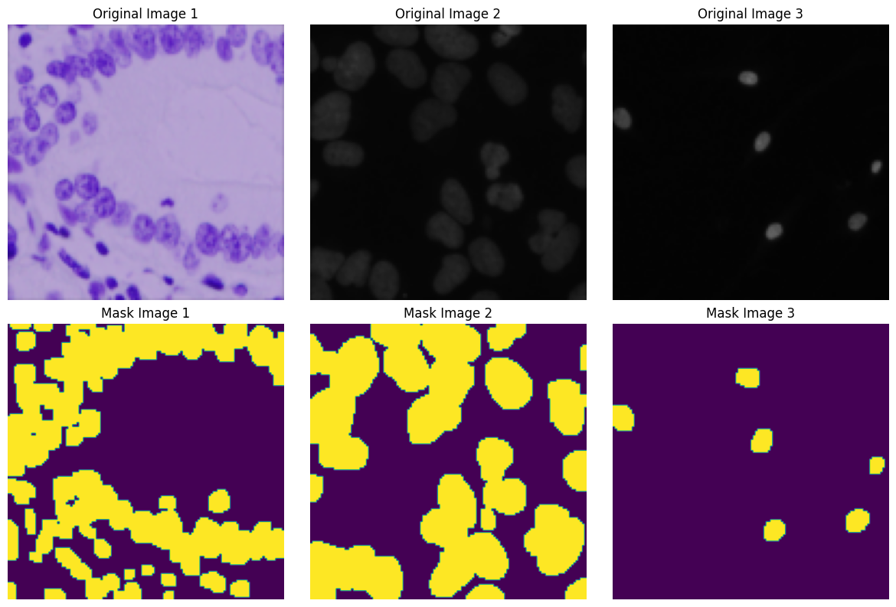
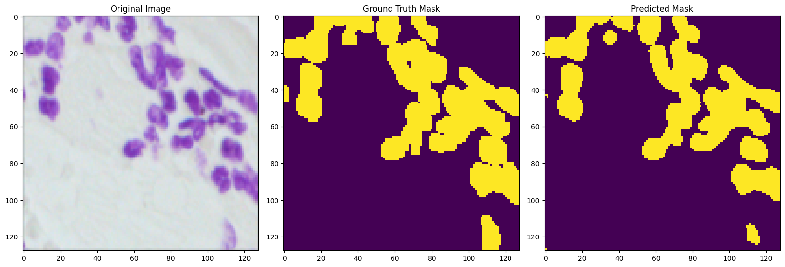
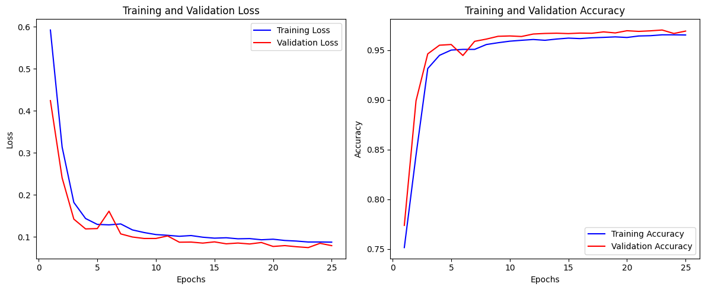

# Automated Nucleus Detection for Medical Discovery

  

*[Eukaryotic cell](https://giphy.com/embed/XlH7x63YyqTU4).* 

## Overview
The **2018 Data Science Bowl** presented a significant challenge with profound implications for medical research: creating an algorithm to automate the detection of cell nuclei across diverse images. This task is more than an academic exercise; it's a vital step in speeding up research for a wide array of diseases, from common ailments like the cold to life-threatening conditions like cancer and heart disease.
The nucleus of a cell holds its **DNA**, the fundamental genetic code guiding its functions. By automating the detection of nuclei, researchers can more rapidly understand cellular behaviors and reactions to treatments. This advancement holds the potential to revolutionize the pace of medical discoveries and drug development, reducing the time to market for new medications and therapies.

## Project Objective
This repository hosts a comprehensive solution to the challenge of automated nucleus detection. Utilizing **advanced image processing** and **deep learning** techniques, specifically the **U-Net** architecture, the project aims to provide an efficient and accurate method for identifying cell nuclei in various biomedical images.

## Methodology
The approach is structured as follows:

- **Data Preprocessing**: Standardizing the dataset for optimal model training.
  
- **Model Development**: Building a U-Net based convolutional neural network.
  
- **Training and Validation**: Rigorous testing and validation of the model's performance.
  
- **Evaluation**: Assessing the model against a set of unseen images to ensure reliability and accuracy.

## Dataset
The dataset is from [Kaggle's 2018 Data Science Bowl Dataset](https://www.kaggle.com/competitions/data-science-bowl-2018), which is hosted on Kaggle. It contains a large number of segmented nuclei images that were acquired under a variety of conditions and vary in cell type, magnification, and imaging modality (brightfield vs. fluorescence).

To download the dataset, you will need a Kaggle account and the Kaggle API installed on your machine. Follow these steps:

1. Go to your Kaggle account settings and scroll down to the API section to create a new API token. This will download a `kaggle.json` file containing your API credentials.
3. Place the `kaggle.json` file inside the main notebook when the snippet below is executed:

from google.colab import files

uploaded = files.upload()  # Upload the kaggle.json file here

## Exploratory Data Analysis (EDA)

In this section, we explored the dataset to gain insights into the characteristics of the cell images used for nucleus detection.

### Sample Images

To visualize the dataset, we displayed a random sample of original images associated with their masked version.

  

The sample images showcase the diversity of cell appearances and highlight the challenges of masking them accurately.

## Results

### Visualization of Model Predictions
For a randomly selected sample from the dataset, the original image, the ground truth mask, and the predicted mask were displayed.

  

The results showcase the model's ability to segment nuclei within biomedical images. 

**Original Image**: Displays the raw input image as received by the model, containing multiple nuclei that need to be segmented.

**Ground Truth Mask**: Represents the expert-annotated mask that highlights the actual location of nuclei. These annotations serve as the standard against which the model's predictions are compared.

**Predicted Mask**: Shows the model's output, indicating where it has identified nuclei. The color differentiation clearly distinguishes the segmented nuclei from the background.

The overlap between the ground truth and predicted masks indicates successful nucleus detection, while any discrepancies point to areas where the model might need further tuning. Overall, the close visual alignment between the ground truth and predicted masks suggests that the model is performing well, capturing the majority of the nuclei with a high degree of accuracy.

### Training Accuracy and Loss Curves
The figures present the model's performance across the training epochs:

  

**Training Loss**: This shows a significant decrease, particularly in the initial epochs, indicating that the model is learning and improving its ability to segment the nuclei.

**Validation Loss**: Initially follows the training loss closely but starts to plateau towards the later epochs, which is common as the model starts to converge.

**Gap Between Training and Validation Loss**: It is relatively small, suggesting that the model isn't severely overfitting. However, there are slight fluctuations in validation loss, which could indicate some variance in the validation data that the model finds harder to generalize.

**Training Accuracy**: Starts high and increases slightly over epochs, leveling off towards the end. This indicates that the model fits the training data well.

**Validation Accuracy**: Mirrors the training accuracy closely and remains high, which is a good indicator that the model generalizes well to unseen data.

**Consistency Between Training and Validation Accuracy**: The two lines are close together throughout the training process, which again suggests good generalization and that overfitting is minimal.

## Tuned Model Results and Comparison

Following the initial success of the UNet model, I employed hyperparameter tuning to further refine the model's performance. The tuning process involved systematically searching for the optimal combination of hyperparameters using a **Keras Tuner**, a powerful hyperparameter optimization framework, to methodically explore and identify the best combination of hyperparameters.

### Performance Comparison: Untuned vs. Tuned U-Net Models
The comparison between the untuned and tuned U-Net models yields the following insights:

- **Training Loss**: The untuned model showed a marginally lower training loss at **0.0877** compared to the tuned model's **0.0885**. This indicates a very slight edge in fitting the training data for the untuned model.

- **Validation Loss**: Notably, the untuned model outperformed with a validation loss of **0.0794**, against **0.0933** for the tuned model, suggesting better generalization on unseen data in the untuned model.

- **Training Accuracy**: Both models achieved high training accuracy, with the tuned model at **96.61%** marginally surpassing the untuned model's **96.54%**.

- **Validation Accuracy**: The untuned model exhibited a higher validation accuracy of **96.93%**, compared to **96.29%** for the tuned model, indicating slightly superior performance on the validation set.

These findings underscore the complexity of hyperparameter tuning and its impact on model performance. They suggest that the initial parameters used in the untuned model were already quite effective for this specific task.

## Setting Up the Environment
To run the notebooks in this repository, you can create a Conda environment with all the necessary dependencies using the provided **nucleus-segmentation-env.yml** file. Follow these steps:

1. Ensure you have [Anaconda](https://www.anaconda.com/products/individual) or [Miniconda](https://docs.conda.io/en/latest/miniconda.html) installed.
2. Clone or download this repository to your local machine.
3. Navigate to the repository directory in your terminal.
4. Run `conda env create -f nucleus-segmentation-env.yml` to create the environment.
5. Once the environment is created, activate it with `conda activate nucleus-segmentation-env.yml`.

## Conclusion
In this project, I have successfully developed and trained a U-Net model capable of accurately detecting nuclei in a variety of biomedical images. The implementation of advanced image processing techniques and deep learning has proven to be effective, as demonstrated by the close correspondence between the model's predictions and the ground truth annotations.

## Acknowledgments
- I extend my gratitude to the organizers of the **2018 Data Science Bowl** for providing a platform and dataset that sparked this exploration into medical image segmentation. I also thank the open-source community for the invaluable tools and frameworks that made this project possible.

